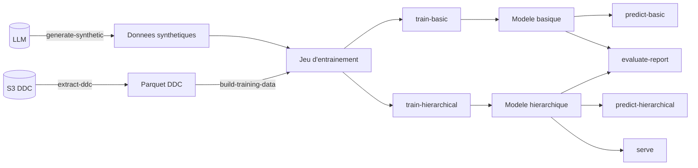
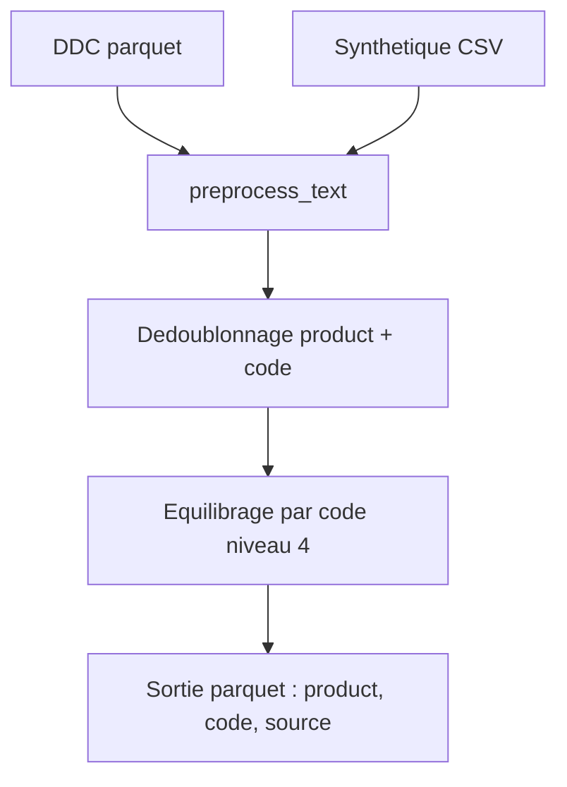
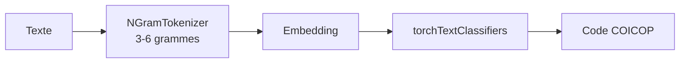
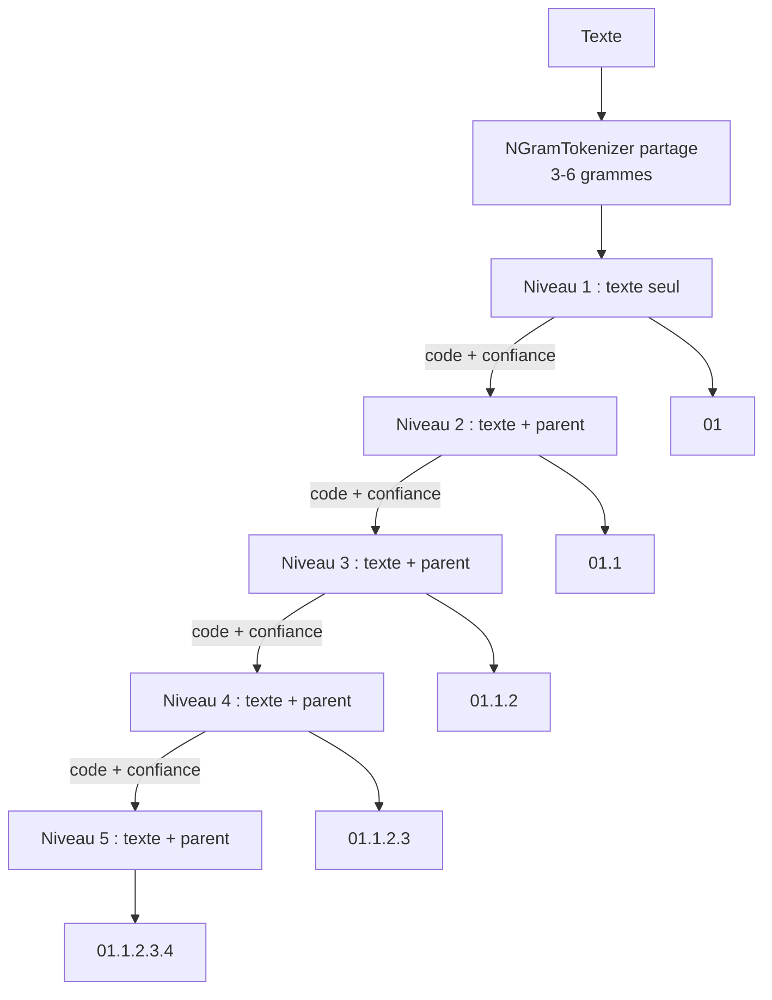

# COICOP BDF Classifier

Classifieur de textes produits vers des codes [COICOP](https://www.insee.fr/fr/information/8616409) (Classification of Individual Consumption According to Purpose), construit pour l'enquête Budget de Famille (BdF) de l'INSEE.

Deux approches de classification sont proposées :

- **Classifieur basique** : classifieur plat unique qui predit directement le code COICOP complet
- **Classifieur hierarchique** : cascade de 5 classifieurs (un par niveau COICOP), ou chaque niveau utilise les predictions du niveau parent comme features supplementaires

Les deux approches utilisent un tokenizer n-grammes de caracteres (3-6 grammes) via la bibliotheque `torchTextClassifiers`.

## Installation

Prerequis : Python 3.13 (voir `.python-version` à la racine du dépôt).

```bash
uv sync --locked
```

Le dépôt est un workspace `uv` : le lock est à la racine, et cette commande n'installe
que les dépendances de ce module (voir « Environnement Python » dans le README racine).

## Vue d'ensemble du pipeline



## Extraction des donnees de caisse (`extract-ddc`)

La commande `extract-ddc` extrait les donnees de caisse (DDC) depuis le stockage S3 via DuckDB, applique un mapping COICOP, et produit un fichier parquet pret a l'emploi.

### Fonctionnement

1. **Lecture S3** : les fichiers parquet DDC sont lus depuis `s3://projet-ddc/.../annee={ANNEE}/mois={MOIS}/` pour les annees et mois demandes.
2. **Dedoublonnage** : les lignes sont dedoublonnees sur le triplet `(description_ean, variete, id_famille)`.
3. **Mapping COICOP** :
   - Si la variete commence par `"99"`, le code COICOP est recupere depuis la table `famille_circana.csv` par jointure sur `id_famille`.
   - Sinon, le champ `variete` est utilise directement comme code COICOP.
4. **Filtrage** : seuls les codes COICOP d'au moins 10 caracteres sont conserves, et les codes commencant par `"99"` sont exclus.
5. **Ecriture** : le resultat est ecrit en parquet sur S3.

### Colonnes de sortie

| Colonne | Description |
|---------|-------------|
| `description_ean` | Texte du produit |
| `variete` | Code variete d'origine |
| `coicop_code` | Code COICOP apres mapping |

### Commande CLI

```bash
uv run python main.py extract-ddc \
    --annee 2024 2025 \
    --mois 1 2 3 \
    --famille data/famille_circana.csv \
    --memory 6GB
```

| Argument | Obligatoire | Defaut | Description |
|----------|:-----------:|--------|-------------|
| `--annee` | oui | — | Annee(s) a extraire |
| `--mois` | non | tous les mois | Mois a extraire |
| `--output` | non | `s3://travail/.../ddc_{DATE}.parquet` | Chemin S3 de sortie |
| `--famille` | non | `data/famille_circana.csv` | Fichier CSV de mapping famille Circana |
| `--memory` | non | `6GB` | Limite memoire DuckDB |
| `--dry-run` | non | `False` | Affiche le SQL genere sans l'executer |
| `--encrypt` | non | `False` | Chiffre le parquet de sortie (AES-GCM 256 bits), affiche la cle dans les logs |
| `--encryption-key` | non | `None` | Cle de chiffrement parquet (hex, 32 chars). Implique `--encrypt` |

Le mode `--dry-run` affiche l'integralite du SQL qui serait execute sans se connecter a S3 :

```bash
uv run python main.py extract-ddc --annee 2024 --dry-run
```

## Generation des donnees synthetiques (`generate-synthetic`)

La commande `generate-synthetic` (`src/data/synthetic_generator.py`) produit le CSV
`data/synthetic_data.csv` consomme par `build-training-data` : des libelles de produits
au style ticket de caisse (majuscules, sans accents, sans prix), generes par un LLM
compatible OpenAI pour chaque code COICOP du niveau choisi, a partir des notes RMES
(`comprend` / `ne comprend pas`).

Dependances et configuration :

```bash
uv sync --locked --extra synth
export OPENAI_API_KEY=...            # obligatoire (sauf --dry-run)
export OPENAI_BASE_URL=...           # endpoint compatible OpenAI
export OPENAI_MODEL=gemma4-26b-moe   # defaut
```

```bash
# Voir les prompts sans appeler le LLM
uv run python main.py generate-synthetic --dry-run --max-categories 3

# Generation complete, nombre d'exemples par code module par le volume DDC
uv run python main.py generate-synthetic --ddc data/raw/ddc.parquet --max-workers 4

# Codes techniques 98/99 seulement, dans un fichier separe
uv run python main.py generate-synthetic --technical only --output data/synthetic_technical.csv \
    --raw-dir data/synthetic_raw_technical --manifest data/synthetic_manifest_technical.json
```

Pour chaque categorie :

1. **Sortie LLM en trois paliers** : sortie structuree (pydantic) → tableau JSON strict → parseur ligne a ligne.
2. **Validation** : chaque libelle doit survivre a la chaine `preprocess_text` (copie scalaire `clean_product`, dont l'equivalence est testee) et mesurer au plus 80 caracteres nettoye ; dedoublonnage sur le texte nettoye.
3. **Verification** (`--verify`, defaut) : un appel LLM par lot confirme l'appartenance de chaque libelle a la categorie (desactivee pour les codes 98/99).
4. **Relances** (`--retries`) tant que le nombre demande n'est pas atteint.

Puis une curation globale supprime les doublons entre codes (le premier code dans l'ordre trie est garde ; les conflits sont listes dans le manifeste).

**Allocation** : sans `--ddc`, `--examples` libelles par code. Avec `--ddc`, selon le nombre de lignes DDC du code de niveau 4 : ≥ 1000 → 0, 500–999 → 100, 100–499 → 200, 1–99 → 300, absent → 400.

**Reprise** : chaque code termine est enregistre dans le manifeste (`--manifest`) et ses libelles acceptes dans `--raw-dir/<code>.jsonl`. Une relance saute les codes deja faits ; `--force` les regenere.

**Nomenclature** : `--coicop` (CSV RMES `;` ou parquet elague). Les codes du niveau presents dans `--reference` mais absents de `--coicop` (ex. codes `X.0` elagues) sont ajoutes avec les notes RMES de leur propre ligne ou de leur plus proche ancetre.

| Argument | Defaut | Description |
|----------|--------|-------------|
| `--output` | `data/synthetic_data.csv` | CSV `product;code;libelle` |
| `--coicop` | `data/coicop-2018_envoi_rmes_20251022.csv` | Nomenclature RMES |
| `--reference` | `data/20260130-coicop_et_codes_techniques.csv` | Liste `"Libelle";"Code"` : codes 98/99 et codes manquants |
| `--level` | `4` | Niveau COICOP genere |
| `--examples` | `300` | Libelles par code (hors allocation DDC) |
| `--ddc` | — | Parquet DDC (local ou S3) pour l'allocation |
| `--codes` | — | Liste de codes separes par des virgules |
| `--technical` | `none` | Codes 98/99 : `none`, `add` ou `only` |
| `--max-categories` | — | Limite le nombre de codes (en `--dry-run` : prompts affiches, 3 par defaut) |
| `--max-workers` | `1` | Codes traites en parallele |
| `--verify` / `--no-verify` | active | Verification LLM de l'appartenance |
| `--retries` | `3` | Relances pour combler un deficit |
| `--force` | — | Regenerer les codes deja dans le manifeste |
| `--dry-run` | — | Affiche les prompts, aucun appel LLM |
| `--temperature`, `--max-tokens` | `0.8`, `8192` | Parametres du LLM |
| `--raw-dir`, `--manifest` | `data/synthetic_raw`, `data/synthetic_manifest.json` | Artefacts de reprise et de provenance |

## Construction du jeu d'entrainement (`build-training-data`)

La commande `build-training-data` construit un jeu de donnees equilibre pret pour l'entrainement a partir des donnees de caisse (DDC) et de donnees synthetiques (produites par `generate-synthetic`).

### Pipeline de pretraitement textuel

Chaque texte passe par la fonction `preprocess_text` (definie dans `src/preprocessing/data_preparation.py`) :


Detail des etapes :

1. **Normalisation** (`normalize_text`, copie de celle de `build-datasets` qui produit `l_pr_product`) — ligatures (`œ` → `oe`), accents retires (NFKD), tout caractere non ASCII supprime (`€`, `°`…), minuscules : `"Crème brûlée BIO 11°"` → `"creme brulee bio 11"`. Le texte d'entrainement (brut) et celui de production (`l_pr_product`) donnent ainsi le meme resultat.
2. **Suppression du bruit** (`remove_noise`) — ponctuation, chiffres, mots d'une seule lettre, expressions vides (`"rien"`, `"rien du tout"`)
3. **Deduplication des tokens** (`tokenize_and_clean`) — `"lait lait entier lait"` → `"lait entier"`
4. **Suppression des lignes vides** (`remove_empty_and_strip`)
5. **Suppression des stopwords** — mots courants definis dans `data/text/stopwords.json`

### Logique d'equilibrage

L'equilibrage opere au **niveau 4 de la COICOP** (prefixe forme des 4 premiers segments du code, ex. `01.1.2.3`). Pour chaque code de niveau 4 :

- **Code surrepresente** (lignes DDC > `max_per_code`) → echantillonnage aleatoire de `max_per_code` lignes DDC, pas de donnees synthetiques ajoutees.
- **Code sous-represente** (lignes DDC ≤ `max_per_code`) → conservation de toutes les lignes DDC + ajout de toutes les lignes synthetiques disponibles.
- **Code absent de la DDC** → inclusion de toutes les lignes synthetiques.

### Flux de donnees



### Schema de sortie

| Colonne | Description |
|---------|-------------|
| `product` | Texte du produit pretraite |
| `code` | Code COICOP complet |
| `source` | Origine de la donnee : `"ddc"` ou `"synthetic"` |

### Commande CLI

```bash
uv run python main.py build-training-data \
    --ddc data/raw/ddc.parquet \
    --output data/data-train.parquet \
    --synthetic data/synthetic_data.csv \
    --max-per-code 1000 \
    --seed 42
```

| Argument | Obligatoire | Defaut | Description |
|----------|:-----------:|--------|-------------|
| `--ddc` | oui | — | Chemin vers le parquet DDC (local, S3 ou HTTP) |
| `--output` | oui | — | Chemin du fichier parquet de sortie |
| `--synthetic` | non | `data/synthetic_data.csv` | Donnees synthetiques, en local ou sur S3 : CSV (separateur `;`, deux premieres colonnes `product;code`) ou parquet (colonnes `product` et `code`, glob accepte) |
| `--max-per-code` | non | `1000` | Nombre max de lignes DDC par code de niveau 4 |
| `--seed` | non | `42` | Graine aleatoire pour la reproductibilite |
| `--encryption-key` | non | `None` | Cle de chiffrement parquet (hex, 32 chars) pour lire/ecrire des fichiers chiffres |

## Classifieurs

### Classifieur basique (`train-basic`)

Classifieur plat unique qui predit le code COICOP complet directement, sans decomposition hierarchique.



**Quand l'utiliser** : plus simple et plus rapide a entrainer, adapte quand la structure hierarchique n'est pas critique.

#### Commande CLI

```bash
uv run python main.py train-basic \
    --data data/data-train.parquet \
    --output checkpoints/basic \
    --num-epochs 20
```

| Argument | Defaut | Description |
|----------|--------|-------------|
| `--data` | (obligatoire) | Parquet d'entrainement (issu de `build-training-data`), local ou `s3://` (avec `--encryption-key` s'il est chiffre) |
| `--output` | `checkpoints/basic` | Repertoire de sortie du modele |
| `--ngram-min` | `3` | Taille minimale des n-grammes |
| `--ngram-max` | `6` | Taille maximale des n-grammes |
| `--ngram-vocab-size` | `100000` | Taille du vocabulaire n-grammes |
| `--embedding-dim` | `128` | Dimension de l'embedding |
| `--max-seq-length` | `64` | Longueur maximale de sequence |
| `--batch-size` | `32` | Taille de batch |
| `--lr` | `0.1` | Taux d'apprentissage |
| `--num-epochs` | `20` | Nombre max d'epoques |
| `--patience` | `5` | Patience pour l'arret precoce |
| `--mlflow-experiment` | `None` | Nom de l'experience MLflow |
| `--eval-data` | `None` | Parquet d'evaluation post-entrainement |
| `--eval-top-k` | `5` | K maximal pour l'evaluation top-k |
| `--encryption-key` | `None` | Cle de chiffrement parquet (hex, 32 chars) pour lire des fichiers chiffres |

### Classifieur hierarchique (`train-hierarchical`)

Cascade de 5 classifieurs, un par niveau COICOP. Chaque niveau N recoit les predictions du niveau N-1 comme features categoriques supplementaires (embedding du code parent + bucket de confiance).



Fonctionnement :

- **Niveau 1** : predit les 13 categories principales (01-13) a partir du texte seul.
- **Niveaux 2-5** : chaque classifieur recoit le texte tokenise + un embedding du code parent predit + un bucket de confiance (discretise en 10 intervalles).
- **Teacher forcing** : pendant l'entrainement, le code parent reel (ground truth) est utilise dans une proportion configurable (defaut : 0.8) au lieu de la prediction du niveau precedent.
- **Tokenizer partage** : un seul `NGramTokenizer` est entraine sur l'ensemble des textes et reutilise a tous les niveaux.

#### Commande CLI

```bash
uv run python main.py train-hierarchical \
    --data data/data-train.parquet \
    --output checkpoints/hierarchical \
    --num-epochs 20
```

| Argument | Defaut | Description |
|----------|--------|-------------|
| `--data` | `data/data-train.parquet` | Parquet d'entrainement, local ou `s3://` (avec `--encryption-key` s'il est chiffre) |
| `--output` | `checkpoints/hierarchical` | Repertoire de sortie |
| `--ngram-min` | `3` | Taille minimale des n-grammes |
| `--ngram-max` | `6` | Taille maximale des n-grammes |
| `--ngram-vocab-size` | `100000` | Taille du vocabulaire |
| `--embedding-dim` | `128` | Dimension de l'embedding |
| `--max-seq-length` | `64` | Longueur maximale de sequence |
| `--batch-size` | `32` | Taille de batch |
| `--lr` | `2e-5` | Taux d'apprentissage |
| `--num-epochs` | `20` | Nombre max d'epoques |
| `--patience` | `5` | Patience pour l'arret precoce |
| `--min-samples` | `50` | Nombre minimum d'exemples par niveau |
| `--teacher-forcing-ratio` | `0.8` | Ratio de teacher forcing (0.0-1.0) |
| `--max-level` | `5` | Profondeur maximale de la hierarchie COICOP a entrainer (1-5) |
| `--no-parent-features` | — | Desactive les features parentales |
| `--resume` | `False` | Reprend l'entrainement depuis le dernier checkpoint |
| `--mlflow-experiment` | `None` | Nom de l'experience MLflow |
| `--eval-data` | `None` | Parquet d'evaluation post-entrainement |
| `--encryption-key` | `None` | Cle de chiffrement parquet (hex, 32 chars) pour lire des fichiers chiffres |

#### Fine-tuning (`fine-tune-hierarchical`)

Permet d'affiner un modele hierarchique pre-entraine sur de nouvelles donnees. On peut cibler des niveaux specifiques a re-entrainer.

```bash
uv run python main.py fine-tune-hierarchical \
    --model checkpoints/hierarchical/hierarchical_model \
    --data data/new-data.parquet \
    --output checkpoints/fine-tuned \
    --levels level3,level4,level5
```

| Argument | Defaut | Description |
|----------|--------|-------------|
| `--model` | (obligatoire) | Chemin du modele pre-entraine |
| `--data` | (obligatoire) | Nouvelles donnees d'entrainement (parquet, local ou `s3://`) |
| `--output` | (obligatoire) | Repertoire de sortie |
| `--levels` | tous | Niveaux a affiner (ex: `level3,level4`) |
| `--max-level` | config du modele | Profondeur maximale de la hierarchie COICOP (1-5) |
| `--lr` | lr original / 10 | Taux d'apprentissage |
| `--num-epochs` | `5` | Nombre d'epoques |
| `--patience` | `3` | Patience pour l'arret precoce |
| `--encryption-key` | `None` | Cle de chiffrement parquet (hex, 32 chars) pour lire des fichiers chiffres |

#### Reprise apres crash (`--resume`)

Si l'entrainement hierarchique est interrompu, l'option `--resume` permet de reprendre depuis le dernier checkpoint sauvegarde. Les niveaux deja entraines sont sautes automatiquement.

```bash
uv run python main.py train-hierarchical \
    --data data/data-train.parquet \
    --output checkpoints/hierarchical \
    --resume
```

## Prediction

### Prediction hierarchique

```bash
# Texte(s) en ligne de commande
uv run python main.py predict-hierarchical \
    --model checkpoints/hierarchical/hierarchical_model \
    "pain complet bio" "bouteille eau minerale"

# Depuis un fichier
uv run python main.py predict-hierarchical \
    --model checkpoints/hierarchical/hierarchical_model \
    --file input.csv \
    --output predictions.csv \
    --top-k 3
```

| Argument | Defaut | Description |
|----------|--------|-------------|
| `--model` | `checkpoints/hierarchical/hierarchical_model` | Chemin du modele |
| `--file` | `None` | Fichier d'entree pour la prediction par lot |
| `--output` | `predictions_hierarchical.csv` | Fichier de sortie |
| `--text-column` | `product` | Colonne contenant le texte |
| `--batch-size` | `64` | Taille de batch |
| `--top-k` | `1` | Nombre de predictions par niveau |
| `--confidence-threshold` | `None` | Seuil de confiance minimal par niveau |

### Prediction basique

```bash
uv run python main.py predict-basic \
    --model checkpoints/basic/basic_model \
    "pain complet bio"
```

| Argument | Defaut | Description |
|----------|--------|-------------|
| `--model` | `checkpoints/basic/basic_model` | Chemin du modele |
| `--file` | `None` | Fichier d'entree |
| `--output` | `predictions_basic.csv` | Fichier de sortie |
| `--top-k` | `1` | Nombre de predictions |

## Evaluation

### Rapport d'evaluation (`evaluate-report`)

Genere un rapport complet sur des donnees annotees (repertoire `data/annotated/`). Metriques calculees : accuracy, F1, top-k accuracy, ventilees par niveau COICOP, source, montant et type de magasin.

```bash
uv run python main.py evaluate-report \
    --model checkpoints/basic/basic_model \
    --data-dir data/annotated \
    --top-k 5 \
    --output rapport.txt
```

| Argument | Defaut | Description |
|----------|--------|-------------|
| `--model` | `checkpoints/basic/basic_model` | Chemin du modele |
| `--data-dir` | `data/annotated` | Repertoire contenant les CSV annotes |
| `--top-k` | `5` | K maximal pour l'accuracy top-k |
| `--output` | `None` | Fichier de sortie du rapport |
| `--mlflow-run-id` | `None` | Run MLflow existant pour y enregistrer les metriques |
| `--mlflow-experiment` | `None` | Experience MLflow (cree un nouveau run) |
| `--amount-threshold` | `200` | Seuil de depense en euros |

### Evaluation d'un fichier de predictions (`evaluate-predictions`)

Top-k accuracy par niveau COICOP sur la sortie d'une commande `predict-*`
(parquet/CSV, local ou S3), avec ventilation optionnelle par une colonne.

```bash
uv run python main.py evaluate-predictions s3://.../predictions.parquet \
    --code-column code --max-k 5 \
    --output s3://.../evaluation_report.txt \
    --html-output s3://.../evaluation_report.html \
    --report-meta "Modele=runs:/<run_id>/model"
```

| Argument | Defaut | Description |
|----------|--------|-------------|
| `--code-column` | `code` | Colonne du code COICOP vrai |
| `--category-column` | — | Colonne de ventilation (ex. `source`) |
| `--max-k` | `5` | K maximal du top-k |
| `--output` | — | Rapport texte (local ou `s3://`) ; il est aussi affiche sur la sortie standard |
| `--html-output` | — | Rapport HTML autonome (local ou `s3://`) : tableaux par niveau et par categorie, accuracy par code et confusions les plus frequentes au niveau le plus fin evalue |
| `--report-meta` | — | Ligne `CLE=VALEUR` ajoutee en tete du HTML (repetable) |
| `--mapping-file` | — | `mapping_lvl4` de prune-codes (local ou `s3://`) : verite canonique `code_lvl4`, predictions elaguees, regle de l'etape `evaluate` (troncature puis egalite, N constant, niveaux 1 a 4) |

Un modele de niveau 4 evalue contre des codes a 5 niveaux n'a pas de ligne
evaluable au niveau 5 (`N = 0`) : c'est attendu.

### Entrainement et evaluation via Argo (`argo/train-ttc-pipeline.yaml`)

Workflow hors pipeline de codification. Il **reconstruit ses entrees avec les memes
etapes que codif-pipeline**, sur un fichier etiquete, pour que ses chiffres soient
comparables a ceux de l'etape `evaluate` :

```
build-datasets -> classify-regex -> prune-codes -> resolve-inputs -+
train (GPU, en parallele des le depart) ---------------------------+-> evaluate-base
                                                                   +-> fine-tune (GPU) -> evaluate-fine-tuned
```

1. **`build-datasets`, `classify-regex`, `prune-codes`** : copies conformes des
   templates de `codif-pipeline.yaml` (`scripts/check_pipeline.py` echoue si elles
   divergent), lancees sur `input_file` avec `label-column`. Par defaut, la
   configuration etiquetee de `argo/params.yaml` : les annotations vague 1 2026
   (`annotations_vague1_2026_a_codif.parquet`, verite `code_previous`, texte
   `NAT_DEP`). Elles ecrivent sous `workflow_runs/{run_date}/{run_id}/` (le run_id
   est le nom du workflow). `sample-observations` limite le jeu evalue.
   **`resolve-inputs`** lit ensuite, par `codif_common.contracts.artifact()` (entree
   `train-ttc` de `contracts.yaml`) :
   - jeu d'evaluation : `classify-regex/raw_test_without_regex.parquet`, le fichier
     d'entree moins ce que la regex a code, c'est-a-dire ce que `classify-ttc` code
     dans le pipeline ;
   - jeu de fine-tuning : `build-datasets/annotations_full.parquet`, les **anciennes**
     annotations (BdF 2017, suggester, BdF 2024) qui forment la KB de
     `rag-annotations`. Il est construit sans `input_file`, donc vague 1 n'y entre pas ;
   - mapping : `prune-codes/mapping_lvl4.parquet`.

   Elle verifie qu'ils sont lisibles, portent les colonnes attendues et que le jeu
   d'evaluation a des etiquettes.
2. **`train`** (GPU) : `train-basic` sur `train-data` (par defaut
   `ddc_train_20260930-full.parquet`) ; tous les parametres de la commande sont
   exposes. Le run MLflow est cree par l'etape, nomme d'apres le workflow, et repris
   par `train-basic` via `MLFLOW_RUN_ID`.
3. **`evaluate-base`** : `predict-basic` avec ce modele sur le jeu d'evaluation, puis
   `evaluate-predictions --mapping-file` : verite `code_lvl4` et predictions tronquees
   au niveau 4 puis elaguees, regle de l'etape `evaluate` (troncature au niveau k puis
   egalite, N constant). Sorties sous `output-prefix/base/` (par defaut
   `s3://projet-budget-famille/data/workflow_outputs/train-ttc/<workflow>`).
4. **`fine-tune`** (GPU, si `fine-tune=true`), en parallele de `evaluate-base` :
   `fine-tune-basic` part du modele de `train`, sur les annotations, dans une
   experience MLflow distincte (`ft-mlflow-experiment`, par defaut
   `codif-coicop-ttc-finetune` ; tag `base_model_uri`). Codes tronques au niveau
   `ft-code-level` (4) ; seuls les codes connus du modele sont gardes.
5. **`evaluate-fine-tuned`** : meme evaluation, meme jeu, sous `output-prefix/fine-tuned/`.

Sur la vague 1 2026, 22,6 % des libelles distincts evalues existent a l'identique
dans les anciennes annotations : ce sont des libelles courants qui reviennent d'une
vague a l'autre (pas les memes lignes), comme ils reviendront en production.

```bash
argo submit argo/train-ttc-pipeline.yaml --watch
# Run court de validation, sans fine-tuning, sur 1 000 lignes evaluees
argo submit argo/train-ttc-pipeline.yaml -p git-branch=ma-branche -p num-epochs=1 \
    -p fine-tune=false -p sample-observations=1000 --watch
# Autre fichier etiquete
argo submit argo/train-ttc-pipeline.yaml -p input_file=s3://.../fichier.parquet -p label-column=code --watch
```

Parametres de fine-tuning : `fine-tune`, `ft-text-column` (`l_pr_product`),
`ft-code-column` (`code`), `ft-code-level` (`4`), `ft-preprocess` (`true`),
`ft-encrypted` (`false`), `ft-lr` / `ft-num-epochs` / `ft-batch-size` / `ft-patience`
(vides = defauts de `fine-tune-basic` : lr d'origine / 10, 5 epochs, batch d'origine,
patience 3), `ft-pilot-2024-only` (`false` ; `true` = annotations du pilote 2024
seules, rapport sous `fine-tuned-2024/`), `ft-mlflow-experiment`.

`fine-tune-basic` accepte en `--model` un dossier local ou une URI MLflow
(`runs:/…`, `models:/…`, `mlflow-artifacts:/…`), et `--code-level N` tronque les codes
de `--code-column` au niveau N avant le fine-tuning. `train-basic` et `fine-tune-basic`
acceptent `--code-level N` et `--exclude-sources SOURCE…` (lignes retirees selon
`--source-column`, `source` par defaut).

Le modele retenu se recopie ensuite dans `classify-ttc-model-uri` (`argo/params.yaml`).

#### Comparaison : modele entraine sur les seules annotations (`argo/train-ttc-annotations-pipeline.yaml`)

```
build-datasets -> classify-regex -> prune-codes -> resolve-inputs -> train (GPU) -> evaluate
```

Meme construction des entrees que `train-ttc-pipeline.yaml`, mais le modele est
entraine uniquement sur `build-datasets/annotations_full.parquet` (anciennes
annotations : BdF 2017, suggester, BdF 2024), avec `train-basic --code-level 4
--preprocess`, dans l'experience MLflow `codif-coicop-ttc-annotations` (tag
`train_source=annotations_full`). Architecture et hyperparametres par defaut
identiques a `train-ttc`.

L'evaluation est **la meme** : meme `input_file`, meme tirage (`sample-observations`,
seed 42 de classify-regex), meme verite `code_lvl4` et meme regle que l'etape `evaluate`.
Les rapports se comparent donc directement :

| Modele | Rapport |
|---|---|
| DDC + synthetique | `…/workflow_outputs/train-ttc/<workflow>/base/evaluation_report.html` |
| DDC + synthetique, fine-tune sur les annotations | `…/workflow_outputs/train-ttc/<workflow>/fine-tuned/evaluation_report.html` |
| Annotations seules | `…/workflow_outputs/train-ttc-annotations/<workflow>/annotations/evaluation_report.html` |
| Annotations du pilote 2024 seules (`pilot-2024-only=true`) | `…/workflow_outputs/train-ttc-annotations/<workflow>/annotations-2024/evaluation_report.html` |
| DDC + synthetique, fine-tune sur le pilote 2024 seul (`ft-pilot-2024-only=true`) | `…/workflow_outputs/train-ttc/<workflow>/fine-tuned-2024/evaluation_report.html` |

```bash
argo submit argo/train-ttc-annotations-pipeline.yaml --watch
# Annotations du pilote 2024 seules (sans bdf_2017 ni suggester)
argo submit argo/train-ttc-annotations-pipeline.yaml -p pilot-2024-only=true --watch
```

`pilot-2024-only=true` (et `ft-pilot-2024-only=true` pour le fine-tuning de
`train-ttc`) passe `--exclude-sources bdf_2017 suggester` : ne restent que
`receipts_from_app`, `manual_from_book` et `manual_from_app` (sur le run du
2026-09-08 : 12 767 lignes, 313 codes de niveau 4 dont 46 a une seule ligne, ecartes
par le decoupage stratifie). Le tag MLflow `train_source` / `ft_source` vaut alors
`annotations_pilote_2024`.

Ses templates `build-datasets`, `classify-regex`, `prune-codes`, `resolve-inputs` et
`predict-evaluate` sont des copies conformes (verifiees par `scripts/check_pipeline.py`).
Pour comparer, garder les memes `input_file`, `label-column` et `sample-observations`
dans les deux workflows.

### Top-k accuracy (`topk_accuracy.py`)

Script autonome pour calculer la top-k accuracy a partir d'un parquet de predictions :

```bash
uv run python topk_accuracy.py predictions.parquet --top-k 5
```

## Serveur API (`serve`)

Demarre un serveur FastAPI servant le modele hierarchique.

```bash
uv run python main.py serve \
    --model checkpoints/hierarchical/hierarchical_model \
    --host 0.0.0.0 \
    --port 8000
```

### Endpoints

| Methode | Endpoint | Description |
|---------|----------|-------------|
| `GET` | `/health` | Etat du serveur et du modele |
| `GET` | `/model/info` | Informations sur le modele (niveaux, nombre de classes) |
| `POST` | `/predict` | Prediction pour un texte unique |
| `POST` | `/predict/batch` | Prediction par lot (max 1024 textes) |
| `GET` | `/` | Interface web (frontend statique) |

### Exemple de requete

```bash
curl -X POST http://localhost:8000/predict \
    -H "Content-Type: application/json" \
    -d '{"text": "pain complet bio", "top_k": 3}'
```

## Integration MLflow

Activer le suivi MLflow en passant `--mlflow-experiment` a n'importe quelle commande d'entrainement :

```bash
uv run python main.py train-basic \
    --data data/data-train.parquet \
    --output checkpoints/basic \
    --mlflow-experiment "coicop-basic" \
    --eval-data data/data-eval.parquet
```

**Elements enregistres :**

- **Parametres** : hyperparametres du modele et du tokenizer, nombre d'echantillons, nombre de classes
- **Metriques** : nombre de classes et echantillons par niveau, metriques d'evaluation top-k (si `--eval-data` fourni)
- **Artefacts** : modele sauvegarde, poids des classifieurs
- **Pyfunc** (classifieur basique uniquement) : wrapper `mlflow.pyfunc` pour le serving bout-en-bout

## Structure du projet

```
coicop_bdf_classifier/
├── main.py                        # Point d'entree CLI
├── pyproject.toml                 # Dependances (uv)
├── topk_accuracy.py               # Script top-k accuracy
├── src/
│   ├── __init__.py
│   ├── api.py                     # Serveur FastAPI
│   ├── basic_classifier.py        # Classifieur plat (n-grammes)
│   ├── build_training_data.py     # Construction du jeu d'entrainement
│   ├── cascade_classifier.py      # Classifieur cascade (CamemBERT, legacy)
│   ├── classifier.py              # Classe de base
│   ├── data_preparation.py        # Pretraitement et chargement des donnees
│   ├── evaluation_report.py       # Rapport d'evaluation complet
│   ├── extract_ddc.py             # Extraction DDC depuis S3
│   ├── hierarchical_classifier.py # Classifieur hierarchique 5 niveaux
│   ├── mlflow_utils.py            # Utilitaires MLflow (pyfunc wrapper)
│   ├── predict.py                 # Modules de prediction
│   ├── synthetic_generator.py     # Generation de donnees synthetiques (LLM)
│   ├── train.py                   # Orchestration de l'entrainement
│   └── static/
│       └── index.html             # Interface web
├── data/
│   ├── annotated/                 # Donnees annotees pour l'evaluation
│   ├── famille_circana.csv        # Mapping famille Circana → COICOP
│   ├── synthetic_data.csv         # Donnees synthetiques (generate-synthetic)
│   └── text/
│       └── stopwords.json         # Stopwords pour le pretraitement
└── docs/
    └── fine_tuning.md             # Documentation du fine-tuning
```
